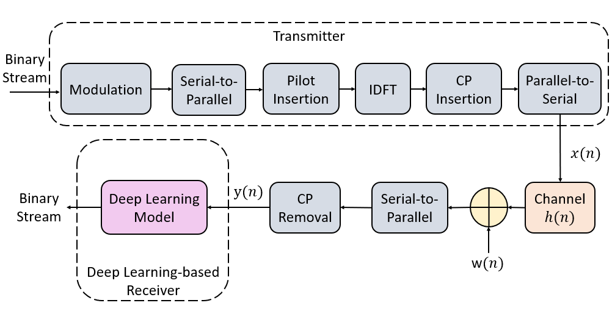
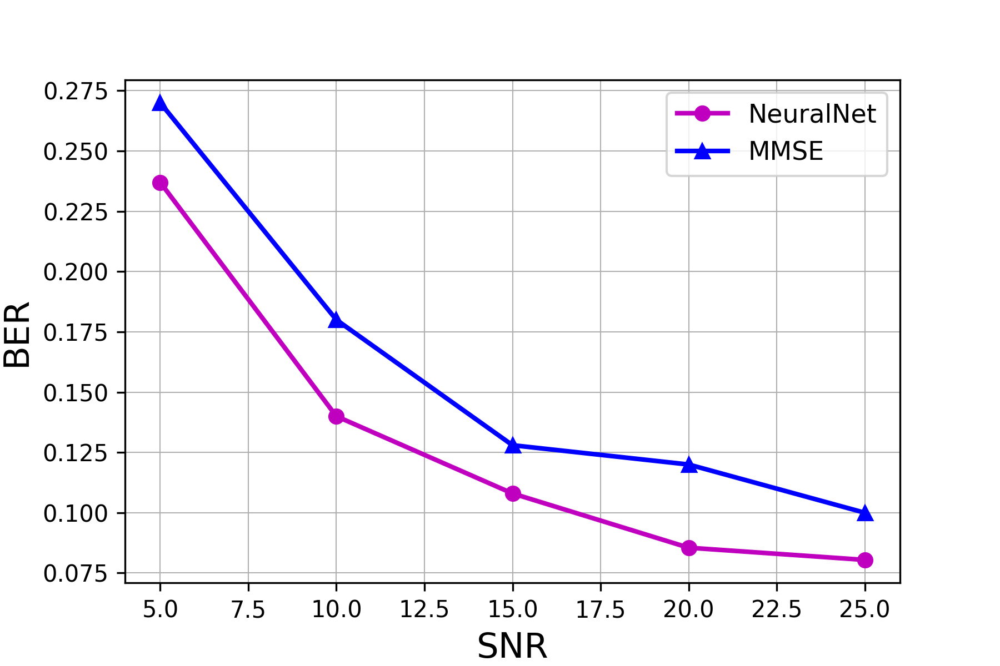

# Neural-OFDM: A Neural Network-based OFDM Receiver
This repository contains a notebook for developing an OFDM receiver using a simple neural network.

The dataset was simulated in python using this [notebook](https://dspillustrations.com/pages/posts/misc/python-ofdm-example.html).

## Bit-Error-Rate (BER) Levels accross Several SNRs

